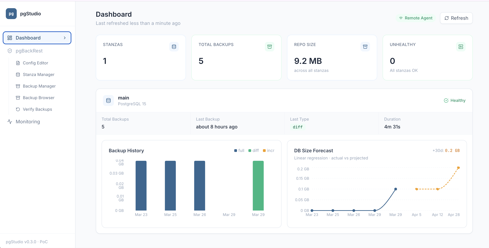
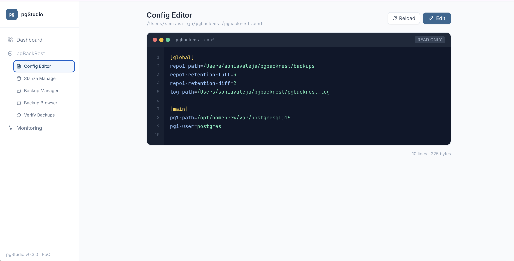
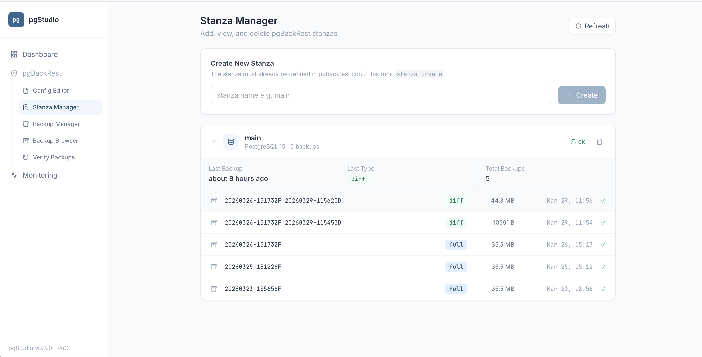
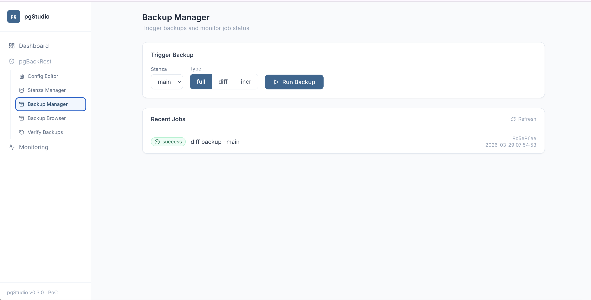
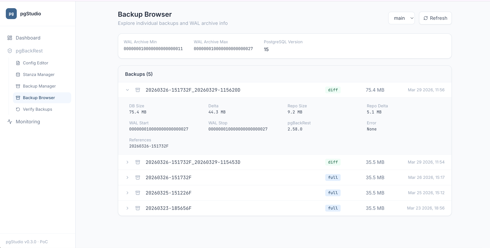
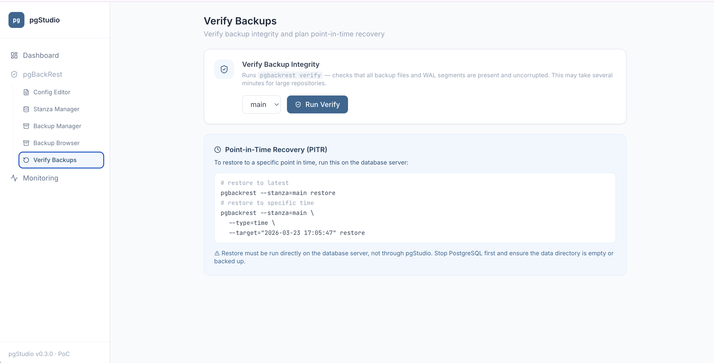
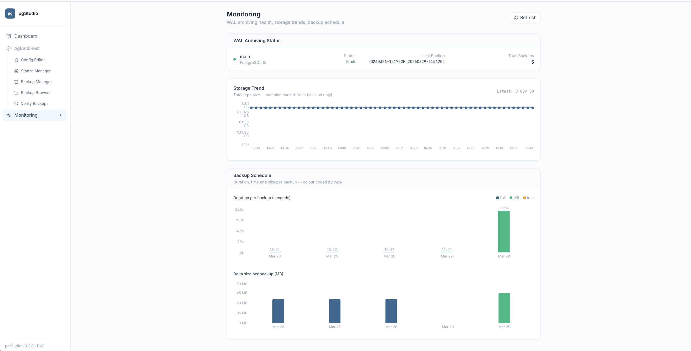

# pgStudio

**PostgreSQL Backup Intelligence** — a web UI and REST API for monitoring and managing [pgBackRest](https://pgbackrest.org/) backups.

> Proof-of-concept. Vibe-coded with Claude. Needs a proper code review before production use.

---

## Screenshots

### Dashboard

*Overview of all stanzas, backup counts, repo sizes, and health status at a glance.*

### Config Editor

*Edit `pgbackrest.conf` directly from the browser.*

### Stanza Manager

*Create and delete pgBackRest stanzas with one click.*

### Backup Manager

*Trigger full, differential, or incremental backups and track job status.*

### Backup Browser

*Browse the complete backup tree including WAL archive metadata.*

### Verify Backup

*Run pgBackRest verify and stream the results in real time.*

### Monitoring

*Per-stanza backup history charts and DB size growth forecasts.*

---

## What it does

| Feature | Description |
|---------|-------------|
| **Dashboard** | Visual overview of all stanzas, backup history, repo sizes, health status |
| **Config Editor** | Edit `pgbackrest.conf` in the browser |
| **Stanza Manager** | Create and delete stanzas |
| **Backup Manager** | Trigger full / diff / incr backups and poll job status |
| **Backup Browser** | Explore the full backup tree with WAL archive metadata |
| **Verify** | Run pgBackRest verify with real-time log streaming |
| **Monitoring** | Per-stanza charts and DB size growth forecasts |
| **REST API** | Standard HTTP endpoints consumable by Grafana, PMM, or any script |
| **Remote agent** | Works when pgBackRest runs on a separate backup server |
| **Demo mode** | Auto-fills mock data when no pgBackRest is found |

---

## Architecture

```
Browser  ──►  React UI (port 3000)
                 │
                 ▼
          FastAPI backend (port 8000)
                 │
        ┌────────┴────────┐
        ▼                 ▼
  pgStudio Agent     pgbackrest CLI     Mock data
  (remote server)    (local server)     (fallback)
```

- **Agent** — a single-file Python script with zero external dependencies, deployed on the backup server. Exposes a small HTTP API the backend polls.
- **Backend** — FastAPI app. Tries agent → local CLI → mock data, in that order. Parses pgBackRest JSON output and exposes versioned REST endpoints.
- **Frontend** — React + Vite SPA, styled with Tailwind CSS, charts via Recharts. Served by nginx inside a Docker container.

---

## Quick Start

### Prerequisites
- Docker
- Docker Compose v2

```bash
# 1. Clone the repo
git clone https://github.com/your-org/pgstudio.git
cd pgstudio/pgstudio-v4

# 2. Start everything (demo mode — no pgBackRest required)
docker compose up --build -d

# 3. Open the UI
open http://localhost:3000

# 4. Browse the API docs (Swagger)
open http://localhost:8000/docs
```

---

## Connecting to a Real pgBackRest

### Option A — pgBackRest on a different server (recommended)

Deploy the agent on your backup server (Python 3 stdlib only — no pip install):

```bash
# On the backup server
python3 agent/pgstudio-agent.py --port 9731 --bind 0.0.0.0
```

Then set the agent URL before starting pgStudio:

```yaml
# docker-compose.yml → backend → environment
PGVAULT_AGENT_URL: "http://<backup-server-ip>:9731"
```

### Option B — pgBackRest on the same server

Leave `PGVAULT_AGENT_URL` unset and mount the pgBackRest config into the backend container:

```yaml
# docker-compose.yml → backend
environment:
  PGBACKREST_BIN: pgbackrest
volumes:
  - /etc/pgbackrest:/etc/pgbackrest:ro
```

---

## REST API

All endpoints return standard JSON. Full interactive docs at `http://localhost:8000/docs`.

| Method | Endpoint | Description |
|--------|----------|-------------|
| `GET` | `/api/v1/pgbackrest/info` | Parsed dashboard data (all stanzas) |
| `GET` | `/api/v1/pgbackrest/info?stanza=main-db` | Single stanza data |
| `GET` | `/api/v1/pgbackrest/stanzas` | List stanza names |
| `GET` | `/api/v1/pgbackrest/stanzas/{name}` | Full detail for one stanza |
| `GET` | `/api/v1/pgbackrest/raw` | Raw pgBackRest JSON output |
| `POST` | `/api/v1/manage/backup` | Trigger a backup job |
| `GET` | `/api/v1/manage/jobs` | List background jobs |
| `GET` | `/api/v1/manage/jobs/{id}` | Job status and logs |
| `POST` | `/api/v1/manage/verify` | Verify backup integrity |
| `POST` | `/api/v1/manage/stanza/create` | Initialise a stanza |
| `POST` | `/api/v1/manage/stanza/delete` | Delete a stanza |
| `GET` | `/health` | API health check |

### Grafana / PMM integration example

```bash
curl http://localhost:8000/api/v1/pgbackrest/info | jq .
```

Point Grafana's **JSON datasource** at `http://<pgstudio-host>:8000/api/v1/pgbackrest/info` for custom panels.

---

## Project Structure

```
pgstudio-v4/
├── agent/
│   └── pgstudio-agent.py        # Deploy this on the backup server
├── backend/
│   ├── main.py                  # FastAPI app entry point
│   ├── routers/
│   │   ├── pgbackrest.py        # Read-only info endpoints
│   │   ├── manage.py            # Backup / verify / stanza management
│   │   └── config.py            # Config file read/write
│   ├── services/
│   │   ├── pgbackrest.py        # Data fetching + parsing (agent → local → mock)
│   │   └── agent.py             # HTTP client for the pgStudio agent
│   ├── requirements.txt
│   └── Dockerfile
├── frontend/
│   ├── src/
│   │   ├── App.jsx
│   │   ├── pages/               # Dashboard, ConfigEditor, StanzaManager, …
│   │   ├── components/          # StatCard, StanzaCard, charts, Sidebar
│   │   └── api/                 # HTTP calls to the backend
│   ├── Dockerfile
│   └── nginx.conf
├── Images/                      # UI screenshots
├── docker-compose.yml
└── README.md
```

---

## Tech Stack

All components use permissive open-source licenses.

| Layer | Technology | License |
|-------|-----------|---------|
| Agent | Python stdlib only | — |
| Backend | FastAPI + Uvicorn | MIT |
| Frontend | React + Vite | MIT |
| Styling | Tailwind CSS | MIT |
| Charts | Recharts | MIT |
| Container | Docker Compose | Apache 2.0 |

---

## Stopping

```bash
cd pgstudio-v4
docker compose down
```

---

## License

MIT — see [pgstudio-v4/LICENSE](pgstudio-v4/LICENSE).
